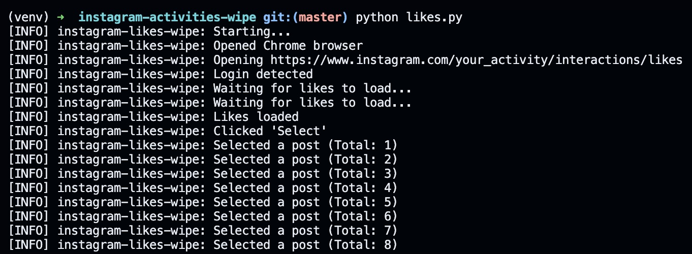

# instagram-activities-wipe

Wipe Instagram comments/likes with Selenium automation in Python.

Instagram does not provide a "Select All" button for deleting comments and likes. Users are forced to manually select each like and comment to delete them. This script automates that process.



**Hope it helps!** Star this repo to save it for later :wink:

Disclaimer: This script is for educational purposes only. Use at your own risk. I am not responsible for any actions taken against your account by Instagram.

Update 05/05/25:

- You can now continue running the script after the rate limit has been reached. The script will automatically resume after it detects the rate limit has been lifted.
- Combined into one script.

Update 03/17/24:

- I have noticed Instagram imposes rate limits on the number of actions you can perform in a given time period. The script will tell you if you have hit the rate limit, and if so, you can try running the script a few hours later.
- Also, the script has been updated to use the same browser profile on every run so you don't have to log in every time (to avoid suspicion from Instagram).

## Prerequisites

- [Python 3.x](https://www.python.org/downloads/)
  - Using brew: `brew install python`
- [Chrome](https://www.google.com/intl/en_us/chrome/)
  - Using brew: `brew install chrome`
- [ChromeDriver](https://chromedriver.chromium.org/downloads)
  - Using brew: `brew install chromedriver`

## Usage

1. Clone this repository
2. Optional: Use a venv

    - macOS/Linux:

      ```shell
      python -m venv venv
      source venv/bin/activate
      ```

    - Windows:

      ```shell
      python -m venv venv
      .\venv\Scripts\activate
      ```

3. Install the required dependencies

    ```shell
    pip install -r requirements.txt
    ```

4. Run the script

    ```shell
    python scripts.py
    ```

    The script logs its progress in the terminal and provides instructions as it runs, so simply follow them.

5. Give the repo a star if it helped!

## Is it safe?

Look at the code ([script.py](script.py). Look at my [LinkedIn](https://www.linkedin.com/in/kenneth-kwan-6bb396262). I am a good guy.

## Contributing

Contributions are welcome! If you find any issues or have suggestions for improvements, please open an issue or submit a pull request.
